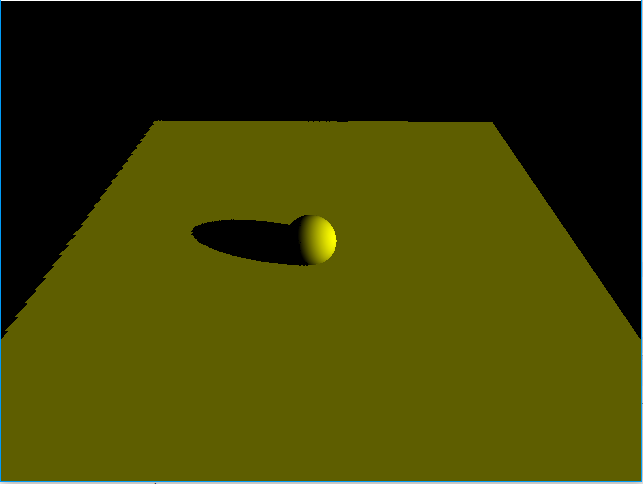
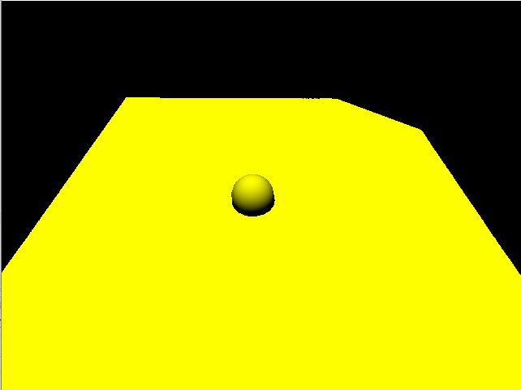
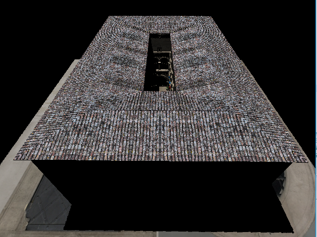

# Implementation of Shadow Mapping with Libgdx and OpenGL

Here is an implementation of Shadow Mapping with Libgdx. Libgdx makes it very easy to manage buffers and memory so we can focus on the 
implementation of the method.

Here, the program focuses on Directioal light. The idea is to render the scene from the light position and store the depth values in a 
texture. Then, when we actually render the scene, we compare the vertex distance to the light with the one stored in the texture. If the
distance is bigger, then the vertex is in the shadow.

Notes on this implementation :
The idea was to render the scene from the light position into a FrameBuffer Object with a Depth Buffer attached and then retrieved the
Depth Buffer. However, I couldn't find a way to retrieve the buffer with Libgdx. Instead, I decided to create an RGBA8888 texture for
the Depth Buffer, and the store the depth values into that texture. 

This means that I had to convert a 32-Bit float into a RBGA8888 value in the fragment shaders.
I came across these functions :
```
vec4 EncodeFloatRGBA( float v )
{
	vec4 kEncodeMul = vec4(1.0, 255.0, 65025.0, 16581375.0);
	float kEncodeBit = 1.0/255.0;
	vec4 enc = kEncodeMul * v;
	enc = fract(enc);
	enc -= enc.yzww * kEncodeBit;
	return enc;
}
```
```
float DecodeFloatRGBA( vec4 enc )
{
	vec4 kDecodeDot = vec4(1.0, 1/255.0, 1/65025.0, 1/16581375.0);
	return dot( enc, kDecodeDot );
}
```

I still have to find if there is a way to retrieve the Depth Buffer from an FBO.

Here are the results :

-Simple scene



We can even see the limits of the Shadow Map :




-Sponza scene :



